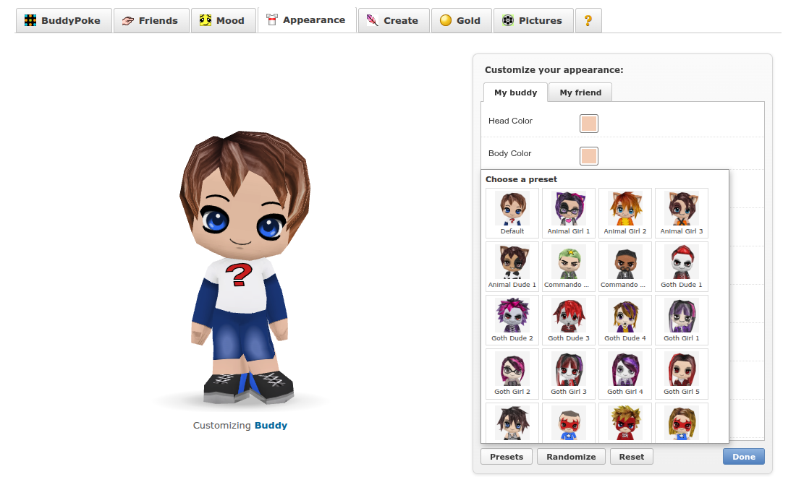
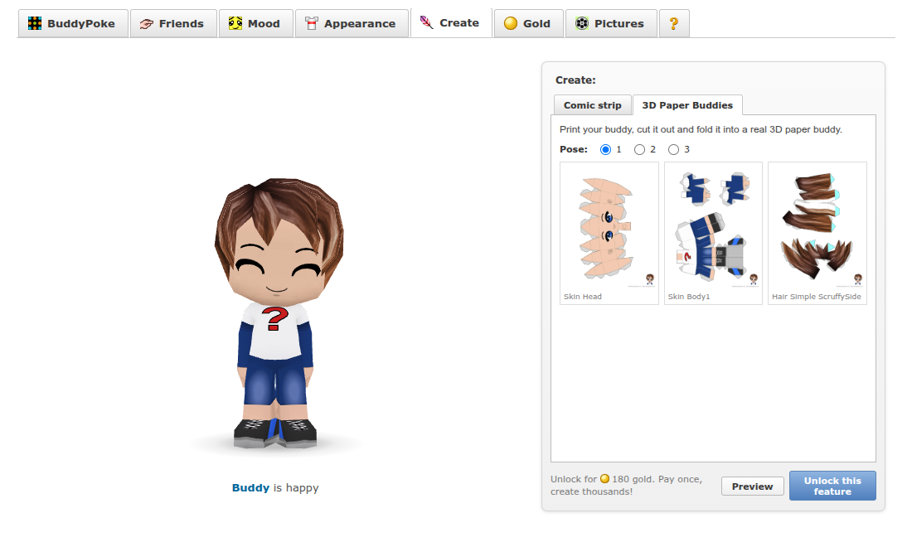

# BuddyPoke (HTML5 port)

The BuddyPoke 3D avatar app, ported from its original Flash SWF to plain HTML, CSS and JavaScript. It has no build step and no dependencies, and it runs in any modern browser with WebGL.

The 3D engine, texture system and animations are line-by-line ports of the decompiled ActionScript. The content (model, artwork, options, moods and pokes) comes from the newest archived version of the MySpace app (July 2009), plus animations and extras recovered from other archived BuddyPoke SWFs. The social side (friends, incoming pokes, gold) is simulated in the browser, because the servers it talked to are long gone.


## Features

| | |
| --- | --- |
|  | **Friends and pokes**: poke your (simulated) friends with a comment, optionally private. They poke you back, poke you on their own and change their moods. |
|  | **Profile and history**: pokes sent and received, gold, and the event history with *poke back*. Click any event to replay it. |
|  | **Appearance**: every original customisation option (hair incl. afros, dreads and witch/wizard hats, face, clothes, jersey numbers, accessories, colours, props, vehicles) plus the customisable background. Drag the buddy to turn it around. |
|  | **Presets**: the 75 ready-made buddies from the original Customization window. |
|  | **Create → Comic strip**: a three-panel comic maker with camera shots and speech bubbles, saved to Pictures. |
|  | **Create → 3D Paper Buddies**: the original papercraft feature. Your buddy is unfolded onto printable pages with fold lines and tabs and saved as a PDF to print, cut and fold. |
|  | **Gold**: earn gold by poking, changing moods and a daily bonus. Spend it on premium moods and pokes (priced as in the original), Paper Buddies and background packs. |

It also has **Pictures** (snapshots and comics kept in your browser) and **?** (names, frame rate, texture detail, and appearance codes compatible with the original app).

## Run locally

The page loads its assets with `fetch`, so serve it over HTTP rather than opening `index.html` directly:

```sh
python3 -m http.server 8000
# open http://localhost:8000
```

## Publish on GitHub Pages

1. Push this repository to GitHub.
2. Go to **Settings → Pages**, choose **Deploy from a branch**, select `main` and `/ (root)`, and save.
3. The site appears at `https://<user>.github.io/<repo>/` after a minute. `.nojekyll` is included so the files are served as-is.

Any other static host (Netlify, Cloudflare Pages, a normal web server) works the same way: upload `index.html`, `css/`, `js/` and `assets/`.

## How it works

| Path | What |
| --- | --- |
| `js/engine/` | Port of `com.buddylabs.player`: matrix math, scene graph, Edgebreaker mesh decompression, skinning and morphs, wavelet animation decoding, and a WebGL painter's-algorithm renderer with affine texture mapping (like the Flash renderer) |
| `js/swf/` | Small SWF parser and Canvas renderer for the embedded material library (vector symbols, gradients, bitmaps, colour transforms, blend modes) |
| `js/medialib.js` | Port of `MediaLibrary.createMaterial`: layered textures with colour tints, masks and lightmaps |
| `js/buddy.js`, `js/pokerenderer.js` | Ports of `SceneObject`/`Buddy`/`SceneSetting` and `BuddyPokeRenderer` (moods, pokes, examine camera, portraits, comic stills) |
| `js/social.js` | Simulated social layer: friends, incoming pokes and poke-backs, event history, gold and the shop |
| `js/app.js`, `js/ui/` | The page UI |
| `js/data/` | Moods, pokes and customisation options, generated from the decompiled ActionScript |
| `js/paper.js` | Port of `PaperDolls` / `PaperDollItem` (3D Paper Buddies) and a small PDF writer |
| `assets/chick.bin` | The buddy content package from the July 2009 app (model, texture SWF, catalog, animations) |
| `assets/anims_v1.bin` | 94 animations recovered from the archived BuddyPoke 1.0 SWF (`buddypoke.s3.amazonaws.com/swf/1.0/BuddyPokeOrkut.swf`) |
| `assets/anims_extra.bin` | Standalone animations found on the archived MySpace CDN (`apologize1/2`) |
| `assets/icons.swf` | Customisation thumbnails (from the Customization window SWF) |
| `assets/presets.json` | The 75 preset buddies (from the Customization window SWF) |
| `assets/paperbuddy.bin` | The Paper Buddies package (unfolded meshes, fold-line templates) |
| `assets/library.json` | Data from the texture SWF's document class (clip rects, colour matrices, lightmaps) |
| `tools/` | Extraction, data-generation and screenshot scripts |

All state (your buddy, friends, history, gold, pictures) is saved in `localStorage`, separately for each visitor.

## Known gaps

- **Locked moods and pokes**: their animations were streamed from `cache01-widget01.myspacecdn.com` and aren't in the Wayback Machine. 40 of 138 moods and 52 of 269 pokes work. All 545 archived files from that CDN folder were checked; only `apologize1/2` were new.
- **Scene backgrounds** for moods and pokes (café, T-rex, dance floor…) came from the same servers and are missing. The customisable background under Appearance works.
- **Social features are simulated**: friends are made up and live only in your browser. Nothing is sent anywhere.

## Rebuilding the assets

You only need this to regenerate `assets/` or `js/data/`; the repository already contains them. The inputs are archived SWFs, decompiled with [JPEXS FFDec](https://github.com/jindrapetrik/jpexs-decompiler) into `extract/` (git-ignored):

- `extract/v2/`: the July 2009 app (`cache01-widget01.myspacecdn.com/1/l_41bcb4abf1f4ddd8d98e3d1e1f074ec4.swf`) exported with `-export script,binaryData,image`, plus `presetsZ.bin` and `icons.swf` from the Customization window SWF (`l_7c4a86122a954bcaa35c4a1c69e49a10.swf`), the two `apologize` files and `paperbuddy.bin` (`l_d0768f796fa19af1c384e460fc88263a.swf`).
- `extract/old_chick.bin`: the content package from the BuddyPoke 1.0 SWF.

```sh
node tools/dump.mjs                                  # unpack chick.bin into extract/v2/pkg/
java -jar ffdec-cli.jar -export script,symbolClass extract/v2/pkg/chick_swf extract/v2/pkg/chick_m.swf
python3 tools/build_library.py                       # -> assets/library.json
python3 tools/build_data.py                          # -> js/data/*.js (options, moods, pokes, defaults)
python3 tools/build_presets.py                       # -> assets/presets.json
node tools/build_extra_anims.mjs extract/v2/anim_*.bin   # -> assets/anims_extra.bin
node tools/extract_v1_anims.mjs                      # -> assets/anims_v1.bin
node tools/screenshots.mjs                           # needs puppeteer-core and a local server on :8765 -> docs/screenshots/
```

## Credits

BuddyPoke was created by BuddyPoke Inc.; the model, artwork and animations in `assets/` come from the original app. This project is an unofficial fan preservation effort and isn't affiliated with BuddyPoke.
